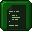

# VIPER developer manual

*As of November 2023, the Viper console is being rewritten from scratch using the Godot Engine. This manual is work-in-progress and might not reflect the console's current features. The cheatsheet part though reflects the current development version*

*If you're consulting this from the viper console, an online version of this manual can be found at <https://viperconsole.github.io>*

## Summary

* [1. Getting started](#h1)
  * [1.1. Presentation](#h1.1)
  * [1.2. Specifications](#h1.2)
  * [1.3. Hello world](#h1.3)
  * [1.4. Tutorials](#h1.4)
  * [1.5. Filesystem](#h1.5)
  * [1.6. Command line / URL arguments](#h1.6)
* [2. Viper's BIOS](#h2)
* [3. API Reference](#h3)
  * [3.1. Language](#h3.1)
    * [3.1.1. Cartridge entry point](#h3.1.1)
    * [3.1.2. Acces to the Viper API](#h3.1.2)
  * [3.2. Graphics API (V.gfx)](#h3.2)
    * [3.2.1. Architecture](#h3.2.1)
    * [3.2.2. Drawing API](#h3.2.2)
    * [3.2.3. Font API](#h3.2.3)
    * [3.2.4. Sprite API](#h3.2.4)
    * [3.2.5. Spritesheets](#h3.2.5)
  * [3.3. Sound API (V.snd)](#h3.3)
    * [3.3.1. Instrument API](#h3.3.1)
    * [3.3.2. Pattern API](#h3.3.2)
    * [3.3.3. Song API](#h3.3.3)
    * [3.3.4. Midi API](#h3.3.4)
  * [3.4. Input API (V.inp)](#h3.4)
    * [3.4.1. Keyboard API](#h3.4.1)
    * [3.4.2. Mouse API](#h3.4.2)
    * [3.4.3. Gamepad API](#h3.4.3)
    * [3.4.4. Generic V.input API](#h3.4.4)
* [4. Cheatsheet](#h4)
  * [4.1. Graphics - layer operations](#h4.1)
  * [4.2. Graphics - drawing operations](#h4.2)
  * [4.3. Graphics - image operations](#h4.3)
  * [4.4. Graphics - font operations](#h4.4)
  * [4.5. Audio - general operations](#h4.5)
  * [4.6. Audio - channel operations](#h4.6)
  * [4.7. Audio - music operations](#h4.7)
  * [4.8. Input - generic operations](#h4.8)
  * [4.9. Input - mouse operations](#h4.9)
* [5. FAQ](#h5)

## <a name="h1"></a>1. Getting started

### <a name="h1.1"></a>1.1. Presentation

Viper is a virtual console inspired by the early 90s hardware : NEC/PCEngine, Amiga 500, Neo-Geo. It's mainly focused on 2D, pixel-art based videogames though it's always possible to write a 3D engine with it.

Some 90s limitations have been lifted. For example, Viper uses 32bits colors instead of indexed palettes but the spirit is to stick with early 90s look and avoid using alpha channel except for layer compositing and parallax effects.

### <a name="h1.2"></a>1.2. Specifications

```
Graphics :  384x224 screen resolution
            32 bits colors with alpha channel support
            display based on a set of transparent layers
            layers can be moved, resized
            layer operations supported (mix, mul, add, sub, ...)
            any number of offscreen spritesheets
            row/colscroll parameters for smooth parallax effects
```

---

```
Sound :     6 channels 44100Hz (native) or 16000Hz (web)
            subtractive synthetizer
            saw, triangle, square, noise generators
            samples support (.wav)
            midi controller input support
```

---

```
Input :     support mouse, keyboard and controller
```

---

```
Resources : can load images (.png) and samples (.wav)
            support for local filesystem and web through https
```

---

```
Code :      uses GDScript
            full support of Godot API including coroutines
```

### <a name="h1.3"></a>1.3. Hello world

From the console main menu, open the code editor  and paste the code below :

```
var x = 10
func draw() :
   V.gfx.clear()
   V.gfx.print(V.gfx.FONT_8X8, "Hello world!", Vector2(x,10))
```

Then press the Start button from the main menu to run the code.

The `draw()` function is called every frame. This is where all the rendering methods from `V.gfx` should be called. The framerate is not guaranteed as it might vary from one target system to another.

You can use the `update()` function to update time dependant variables. This function is called at a fixed rate of 60 times per second. This ensures the game speed will be the same on all systems. This is also where you should handle any user input using the `V.inp` API.

```
func update() :
   x = 10 + V.elapsed()*50 # move at 50 pixels / second
```

There's a third function that you can use to setup things before your game starts :

```
func init() :
   # do some initialization stuff
   pass
```

This is where you should load images and samples because calling the loading functions in the middle of the game would result in pauses, especially when loading resources from https. This function can call rendering functions as it is called during the rendering phase of the first frame.

### <a name="h1.4"></a>1.4. Tutorials

Start the store from the main menu  and enter "tuto" in the filter field. You will find several commented tutorials showcasing the different features of the console.

* tuto01 : drawing basic shapes
* tuto02 : drawing from a spritesheet
* tuto03 : using a custom bitmap font
* tuto04 : parallax scrolling using layers
* tuto05 : single layer parallax scrolling using rowscroll
* tuto06 : sprite shadow using a shadow layer

### <a name="h1.5"></a>1.5. Filesystem

The console has its own inner filesystem where you can copy files by drag'n dropping them on the console window. For example you can drag a "spritesheet.png" image on the console window and then access it from the code as simply "spritesheet.png".

This can also be used to easily replace a resource (a sample or an image) from any game you're running as long as you know the resource filename. Just drop a replacement with the same name on the window and this file will be used instead of the original resource.

You can also access files from outside the console using "file://\<path\>" syntax (only on native version of the console) or "https://\<url\>" to access online resources.

You don't have to edit the code from the console editor, you can use an external editor and simply put the address of the file in the internal code editor :

Type `file://C:/mygame.gd` to load the code from the `C:\mygame.gd` file.

Type `https://mysite.com/mygame.gd` to load the code from the given URL using an HTTP request.

### <a name="h1.6"></a>1.6. Command line / URL arguments

You can use those arguments to control the way the console runs. For example to enable fullscreen at launch :

Use `viper.exe --fullscreen` in native mode.

Use `https://jice-nospam.itch.io/viper-console/?fullscreen=1` in web mode

| Parameter              | Description                                                             |
|------------------------|-------------------------------------------------------------------------|
| **Bios**               |                                                                         |
| `cart=<path>`          | Start a cartridge at launch. `path` = the .gd script to run             |
| `no_deepswitch`        | Disable deepswitch menu (ctrl-shift-\`)                                 |
| `no_docker`            | Disable docker menu                                                     |

| Parameter              | Description                                                             |
|------------------------|-------------------------------------------------------------------------|
| **Graphics**           |                                                                         |
| `no_crt`               | Disable all CRT effects                                                 |
| `no_crt_warp`          | Disable screen warping effect                                           |
| `no_crt_scan`          | Disable scanline effect                                                 |
| `no_crt_mask`          | Disable shadow mask effect                                              |
| `fullscreen`           | Start in fullscreen mode                                                |
| `no_splash`            | Disable splash screen (only on native mode)                             |
| `no_vsync`             | Disable vertical sync (only on native mode)                             |

| Parameter              | Description                                                             |
|------------------------|-------------------------------------------------------------------------|
| **Audio**              |                                                                         |
| `no_audio`             | Start with sound disabled                                               |
| `audio_rate=<rate>`    | Change the audio sample rate (value in Hz)                              |

| Parameter              | Description                                                             |
|------------------------|-------------------------------------------------------------------------|
| **Input**              |                                                                         |
| `neutral_zone=<value>` | Change the controllers default neutral zone (value between 0.0 and 1.0) |

## <a name="h2"></a>2. Viper's BIOS

### <a name="h2.1"></a>2.1. Keyboard shortcuts

| Key              | Command                                                             |
|------------------|---------------------------------------------------------------------|
| Escape<br>Joypad 6*            | Toggle docker menu                                    |
| F12              | Save a screenshot in `%USERPROFILE%\Pictures\Viper`                 |
| Ctrl-Shift-`     | Toggle deepswitch menu                                              |
| X<br>LMB<br>Joypad 0*          | Action1                                               |
| C<br>RMB<br>Joypad 1*          | Action2                                               |

\* : Joypad buttons correspondance

| Button | Sony | XBox | Nintendo |
| ------ | ---- | ---- | -------- |
| 0 | cross | A | B |
| 1 | square | X | Y |
| 6 | start | menu | + |

## <a name="h3"></a>3. API Reference

### <a name="h3.1"></a>3.1. Language

Viper uses GDScript as scripting language.

See <https://docs.godotengine.org/en/stable/tutorials/scripting/gdscript/index.html> for more information

#### <a name="h3.1.1"></a>3.1.1 Cartridge entry point

The following functions are called by the console :

* `func init()` : called once during the cartridge boot.

 This is where external resources should be loaded with

* `V.gfx.load_img` for images
* `V.snd.new_instrument` for sound samples

* `func update()` : called 60 times per second

 This is where you should update anything time dependant. Don't call drawing methods in this function

* `func draw()` : called every frame

 Render one game frame. Framerate might vary from one computer to another. Use `V.gfx.clear()` to erase the previous frame.

#### <a name="h3.1.2"></a>3.1.2 access to the Viper API

All the Viper API can be found under the V singleton :

* `V.gfx` : the graphics API
* `V.snd` : the audio API
* `V.inp` : the V.input API

It also contains a few utilities :

* `V.elapsed() -> float`

This function returns the time elapsed since the game started in seconds.

### <a name="h3.2"></a>3.2. Graphics (V.gfx)

#### <a name="h3.2.1"></a>3.2.1. Architecture

The viper screen size is 384x224 pixels. You can get those values with `V.gfx.SCREEN_WIDTH` and `V.gfx.SCREEN_HEIGHT`. The graphics engine can display on screen any number of transparent layers. Viper doesn't use alpha blending, but a transparent key color that can be changed with `V.gfx.set_transparent_color` (default is pure black).

All colors are expressed with integer component between 0 and 255. All coordinates are floats but for a pixel perfect result, you should truncate them to integers. But smooth movement can be achieved using float coordinates.

Each layer can be resized with `V.gfx.set_layer_size` and moved with `V.gfx.set_layer_offset`.
You can hide and show layers with `V.gfx.show_layer` and `V.gfx.hide_layer`. By default, only one layer (layer 0) is displayed.

The console renders the layers in increasing id order (first layer 0, then 1 on top of it and so on).

Layers can be used to overlay graphics on screen or store bitmap fonts/sprite sheets offscreen. You can copy an image from a layer to another with `V.gfx.set_sprite_layer`, `V.gfx.set_active_layer` and `V.gfx.blit`. You can load an image in the current active layer with `V.gfx.load_img`.

Each visible layer applies a color operation between its color and the underlying color :

* `V.gfx.LAYEROP_SET` : new pixel color = layer pixel color (default)
* `V.gfx.LAYEROP_ADD` : new pixel color = current pixel color + layer pixel color
* `V.gfx.LAYEROP_AVERAGE` : new pixel color = (current pixel color + layer pixel color)/2
* `V.gfx.LAYEROP_SUBTRACT` : new pixel color = current pixel color - layer pixel color
* `V.gfx.LAYEROP_MULTIPLY` : new pixel color = current pixel color * layer pixel color

Example :

`V.gfx.set_layer_operation(1, V.gfx.LAYEROP_ADD)`

You can draw on any layer by activating it with `V.gfx.set_active_layer(id)`.

You can get the number of frames rendered during the last second with :
`V.gfx.fps()`

#### <a name="h3.2.2"></a>3.2.2. Drawing

* `set_active_layer(id)`
* set current drawing layer.
* id is an arbitrary integer value. Visible layers are rendered in ascending id order.

* `load_img(layer, filepath, [resource_name])`
* load an image in a layer.
* warning ! the layer is resized to match the image size.

 filepath is an URL :

* local file : `'myimage.png'`
* remote file : `'https://someserver.com/myimage.png'`
* TODO data URL : `'data:image/png; ...'`

 TODO To convert an image into data url, simply drag and drop it on the console screen.

 If resource_name is defined and not empty, this image can be overriden by the player by running the console with res parameters. This makes it easy for users to mod the game graphics by replacing a named resource with another image.

* `set_layer_size(id, w, h)`
* resize a layer (w,h in pixels).

* `get_layer_size(id)`
* return the layer size in pixels

Example :

```
 local w,h = V.gfx.get_layer_size(0)
```

* `set_layer_offset(id, x, y)`
* set a layer scrolling offset.
 TODO use id -1 to scroll all visible layers (screen shake effect)

* `set_rowscroll(id,[start_row],[end_row],[start_value],[end_value])`
* apply an horizontal skew effect to the layer, moving each row by a specific offset.
* `id` : id of the layer. if no other parameter is set, the rowscroll is disabled for this layer
* `start_row,end_row` : range of row where we want to change the offsets
* `start_value,end_value` : offset value is interpolated between these values (or constant if end_value is nil)

* `set_colscroll(id,[start_col],[end_col],[start_value],[end_value])`
* apply a vertical skew effect to the layer, moving each column by a specific offset.
* `id` : id of the layer. if no other parameter is set, the colscroll is disabled for this layer
* `start_col,end_col` : range of columns where we want to change the offsets
* `start_value,end_value` : offset value is interpolated between these values (or constant if end_value is nil)

* `clear_scroll(id)`
* disable all rows/columns scroll for this layer

Example :

```
gfx.set_rowscroll(0,180,223,0,40)
```

Sets a rowscroll offset for rows 180 to 223. The offset ranges from 0 for row 180 to 40 for row 223

* `set_layer_operation(id, layer_op)`
* set the layer color operation.
* layer_op values : `V.gfx.LAYEROP_SET`/`V.gfx.LAYEROP_ADD`/`V.gfx.LAYEROP_AVERAGE`/`V.gfx.LAYEROP_SUBTRACT`/`V.gfx.LAYEROP_MULTIPLY`.

* `clear([r,g,b])`
* fill the active layer with the color `r,g,b`. If the color is not defined, use the transparent color (default black).

* `blit_pixels(x,y, width, rgb)`
* set pixel colors on current layer.
* x,y is the position on the layer
* width is the width of the sprite
* rgb is an array of colors with format rgb24 (0xRRGGBB). You can use `V.gfx.to_rgb24(r,g,b)` to get this value

 Example :

 `V.gfx.blit_pixels(0,0,1,{255})` would blit a single blue pixel at position 0,0 (255 = 0x0000FF => r=0,g=0,b=255)

 Another way to write it :

 `V.gfx.blit_pixels(0,0,1,{V.gfx.to_rgb24(0,0,255)})`

 Note that this function is far slower than the `V.gfx.blit` function which is fully running on the GPU.

* `line(x1,y1, x2,y2, r,g,b)`
* draw a line

* `triangle(x1,y1, x2,y2, x3,y3, r,g,b)`
* fill a triangle

* `rectangle(x,y, w,h, r,g,b)`
* fill a rectangle

* `circle(x,y, radius_x, [radius_y], r,g,b)`
* draw a circle/ellipse

* `disk(x,y, radius_x, [radius_y], r,g,b)`
* fill a circle/ellipse

#### <a name="h3.2.3"></a>3.2.3. Font

* You define a bitmap font with `set_font` by defining a rectangular zone inside a layer, and the character size :
* `set_font(id, x,y,w,h, char_width,char_height, [charset], [spacing_h],[spacing_v], [chars_width])`
* `id` id of the layer containing the characters sprites
* `x,y,w,h` define a region of a layer as a bitmap font to use with `V.gfx.print`
* `char_width,char_height` if the size of a character in this bitmap (in case of non-monotype font, use the chars_width parameter)
* `charset` is a string representing the characters in the bitmap font.
* if `charset` is not set, the ascii table order is expected.
* `spacing_h,spacing_v` additional horizontal and vertical spacing between characters when drawing text (default 0,0)
* `chars_width` is an array containing the width of each character.
* if `chars_width` is not set, this is a mono font and every character's width is `char_width`
* The function returns a number representing this font. You can use this number to print text.
* The console is preloaded with three fonts :
* `V.gfx.FONT_8X8` : the default mono font that contains the complete 128 ascii table characters.
* `V.gfx.FONT_5X7` : a smaller non-mono font that contains the 93 ascii characters from `!` to `~`.
* `V.gfx.FONT_4X6` : a very small mono font that contains the 93 ascii characters from `!` to `~`.

* `print(font, text, x,y, [r],[g],[b])`
* print the text at position `x,y` using a specific font
* `r,g,b` : multiply the font's character sprites with this color (default white)

 Example : print hello at position 0,0 in white

 `V.gfx.print(V.gfx.FONT_8X8, "hello", 0,0)`

#### <a name="h3.2.4"></a>3.2.4. Sprite

You select a spritesheet with `set_sprite_layer` (default is `V.gfx.SYSTEM_LAYER`). `V.gfx.blit` uses it as a source. The destination is the current active layer.
Source and destination cannot be the same layer.

* `set_sprite_layer(id)`
* define the current source for sprite blitting operations

* `blit(sx,sy,sw,sh, dx,dy, [r,g,b], [angle], [dw],[dh], [hflip],[vflip])`
* blit a rectangular zone from the current sprite layer to the active layer
* warning : using angle = 0 or angle = nil does not produce the same result. See dx,dy description below
* `sx,sy` : top left pixel position in the spritesheet
* `sw,sh` : rectangular zone size in the spritesheet in pixels
* `dx,dy` : destination on active pixel buffer (top left position if angle==nil, else center position)
* `r,g,b` : multiply the sprite colors with this color (default white)
* `angle` : an optional rotation angle in radians
* `dw,dh` : destination size in pixel (if 0,0, or nil,nil, uses the source size). The sprite will be stretched to fill dw,dh
* `hflip, vflip` : whether to flip the sprite horizontally or vertically (default false)

* `blit_col(sx,sy,sw,sh, dx,dy, [r,g,b], [angle], [dw],[dh], [hflip],[vflip])`
* blit a rectangular zone from the current sprite layer to the active layer replacing all non transparent pixels with r,g,b.
* warning : using angle = 0 or angle = nil does not produce the same result. See dx,dy description below
* This function is useful for example if you want to blit a sprite with all white pixels for a hit effect, or to black for drop shadow effects.
* `sx,sy` : top left pixel position in the spritesheet
* `sw,sh` : rectangular zone size in the spritesheet in pixels
* `dx,dy` : destination on active pixel buffer (top left position if angle==nil, else center position)
* `r,g,b` : replace all sprite's pixels with this color (default white)
* `angle` : an optional rotation angle in radians
* `dw,dh` : destination size in pixel (if 0,0, or nil,nil, uses the source size). The sprite will be stretched to fill dw,dh
* `hflip, vflip` : whether to flip the sprite horizontally or vertically (default false)

#### <a name="h3.2.5"></a>3.2.5. Spritesheets

You can define a spritesheet on any layer using the `V.gfx.set_spritesheet` function.

* `set_spritesheet(layer, sprite_w, sprite_h, [off_x], [off_y], [grid_width])`
* return the id of a spritesheet that can be used to easily blit sprites
* `layer` the layer containing the sprites
* `sprite_w, sprite_h` : the size of a sprite in pixels
* `off_x, off_y` : the top-left position of the sprite grid in the layer (default 0,0)
* `grid_width` : in case the spritesheet doesn't use all the layer width, how many sprites are in a row

You can then blit a sprite from this layer using `V.gfx.blit_sprite` :

* `blit_sprite(spritesheet_id, sprite_num, dx, dy, [r,g,b], [angle], [dw],[dh], [hflip],[vflip])`
* blit a sprite from a predefined spritesheet to the active layer.
* warning : using angle = 0 or angle = nil does not produce the same result. See dx,dy description below
* `spritesheet_id` : id returned by the `set_spritesheet` function
* `sprite_num` : number of the sprite in the grid (0 = top-left, row-first order)
* `dx,dy` : destination on active pixel buffer (the sprite's top left position if angle==nil, else center position)
* `r,g,b` : multiply the sprite colors with this color (default white)
* `angle` : an optional rotation angle in radians
* `dw,dh` : destination size in pixel (if 0,0, or nil,nil, uses the sprite size). The sprite will be stretched to fill dw,dh
* `hflip, vflip` : whether to flip the sprite horizontally or vertically (default false)

Example :

```
-- define layer 1 as a grid of 32x32 pixels sprites
spritesheet_id = V.gfx.set_spritesheet(1, 32, 32)
-- blit the top left sprite (#0) on the current layer at position 10,10
gfx.blit_sprite(spritesheet_id, 0, 10, 10)
```

### <a name="h3.3"></a>3.3. Sound (V.snd)

The viper has 6 channels that each can play stereo sound at 48kHz with float32 samples.

#### <a name="h3.3.1"></a>3.3.1. Instrument

You can create any number of instruments that produce sound.
Instrument can either use additive synthesis by using various oscillators or read samples from .wav files.

Oscillator instrument properties:

* oscillator parameters

* `OVERTONE` : amount of overtone
* `OVERTONE_RATIO` : 0 = octave below, 1 = fifth above
* `SAW` : amount of sawtooth waveform (0.0-1.0)
* `ULTRASAW` : amount of ultrasaw in the saw waveform (0.0-1.0)
* `SQUARE` : amount of square waveform (0.0-1.0)
* `PULSE` : width of the square pulse should be in `]0..1[` interval
* `TRIANGLE` : amount of triangle waveform (0.0-1.0)
* `METALIZER` : amount of metalizer in the triangle waveform (0.0-1.0)
* `NOISE` : amount of noise (0.0-1.0)
* `NOISE_COLOR` : from white (0.0) to pink (1.0) noise

* filter parameters

* `FILTER_BAND` : type of filter (`LOWPASS`, `BANDPASS`, `HIGHPASS`, `NOTCH`)
* `FILTER_DISTO` : amount of distortion (0-200)
* `FILTER_GAIN`: lowshelf filter boost in Db (-40, 40)
* `FILTER_CUTOFF`: upper limit of frequencies getting a boost (0-8000)

* lfo parameters

* `LFO_AMOUNT` : amplitude of the lfo waveform (0-1)
* `LFO_RATE` : frequency of the lfo waveform (0-8000)
* `LFO_SHAPE`: type of waveform (`SAW`, `SQUARE`, `TRIANGLE`)
* `LFO_PITCH` : whether the lfo affects the notes pitch (0 or 1)
* `LFO_FILTER`: whether the lfo affects the filter cutoff (0 or 1)
* `LFO_PULSE`: whether the lfo affects the pulse width (0 or 1)
* `LFO_METALIZER`: whether the lfo affects the metalizer amount (0 or 1)
* `LFO_OVERTONE`: whether the lfo affects the overtone amount (0 or 1)
* `LFO_ULTRASAW`: whether the lfo affects the ultrasaw amount (0 or 1)

* envelop parameters

* `ATTACK` : duration of attack phase in seconds
* `DECAY` : duration of decay phase in seconds
* `SUSTAIN` : level of sustain phase between 0.0 and 1.0
* `RELEASE` : duration of release phase in seconds

   By default, envelop is altering the note volume. But it can also be used to alter other parameters :

* `ENV_AMOUNT` : scale the effect of the envelop on the parameter
* `ENV_PITCH` : amount of envelop altering the note pitch
* `ENV_FILTER` : amount of envelop altering the note pitch
* `ENV_METALIZER` : amount of envelop altering the metalizer parameter of the oscillator
* `ENV_OVERTONE` : amount of envelop altering the overtone parameter of the oscillator
* `ENV_PULSE` : amount of envelop altering the pulse width of the oscillator
* `ENV_ULTRASAW` : amount of envelop altering the utrasaw parameter of the oscillator

Sample instrument properties :

* base parameters
  * `FILE` : path to the .wav file
  * `FREQ` : base frequency of the sound in the file

* looping
  * `LOOP_START` : sample index where to start the loop
  * `LOOP_END` : sample index where to end the loop

* envelop
  * `ATTACK` : duration of attack phase
  * `DECAY` : duration of decay phase
  * `SUSTAIN` : duration of sustain phase
  * `RELEASE` : duration of release phase

* `new_instrument(description)` : create a new instrument, return a numerical id for the instrument that can be used in the song patterns (the first is 0 then it is incremented for each new instrument).

   For oscillator instruments, the description starts with the `INST` keyword followed with a list of parameters. It should end with the `NAM` parameter with the instrument name.
   Example:

```
 var triangle_id = V.snd.new_instrument("INST OVERTONE 1.0 TRIANGLE 1.0 METALIZER 0.85 NAM triangle")
 var pulse_id = V.snd.new_instrument("INST OVERTONE 1.0 SQUARE 0.5 PULSE 0.5 TRIANGLE 1.0 METALIZER 1.0 OVERTONE_RATIO 0.5 NAM pulse")
```

   For sample instruments, the description starts with the `SAMPLE`keywords followed with a list of parameters.
   Example :

```
snare_id = V.snd.new_instrument("SAMPLE FILE musics/samples/snare.wav FREQ 17000")
```

* `set_instrument(id, new_description)` : update the parameters of instrument id from a new description
* `play_note(instrument_id, frequency, lvolume, [rvolume], [channel])` : start playing a note on a channel (between 0 and 5). If channel is not defined, any free channel will be used. volume is between 0 and 1
* `set_channel_volume(channel, lvolume, [rvolume])` : change the volume of a channel without interrupting the oscillator/sample
* `set_channel_balance(channel, balance)` : alternative way to change the volume of a channel, balance is between -1 (left) and 1 (right)
* `set_channel_freq(channel, freq)` : change the frequency of a channel without interrupting the oscillator/sample
* `stop_channel(channel)` : mute the channel
* `reserve_channel(channel)` : mark a channel so that it's not used except if explicitely adressed in play_note, play_pattern or play_music
* `release_channel(channel)` : release a channel so that it can be used by play_note, play_pattern or play_music when the channel are not specified

#### <a name="h3.3.2"></a>3.3.2. Pattern

A pattern is a list of notes that plays at a specific rate.

* `new_pattern(description)` : register a new pattern and returns its id (0, then incremented for each new pattern).

The description starts with the `PAT` keyword followed by the notes duration (or speed at which the pattern plays the notes). The duration is divided by 120. For example :

* 01 => each note duration is 1/120 second
* 02 => each note duration is 1/60 second
* 04 => each note duration is 1/30 second

Then it's followed by a list of notes.
Example :

```
new_pattern("PAT 02 F.2070 G.2070 D.3070 C.4070")
```

The note format is [note] [octave] [instrument_id] [volume] [fx] with :

* note : C. C# D. D# E. F. F# G. G# A. A# B.
* octave : between 0 and 8
* volume : hexadecimal between 1 (lowest) and F (highest)
* fx : special sound effect between 0 and 5 :
  * 0 : no effect
  * 1 : slide
  * 2 : vibrato
  * 3 : drop
  * 4 : fade in
  * 5 : fade out

You can add a silence by filling the note format with 6 dots : `......`
Example :

```
new_pattern("PAT 16 C#3915 ...... ...... C#3915 D#3835")
```

* `set_pattern(id, new_description)` : update a pattern
* `play_pattern(id, [channel])` : play the pattern on a channel. If channel is not defined, any free channel will be used.

#### <a name="h3.3.3"></a>3.3.3. Song

A song is an ordered list of patterns to play on one or several of the 6 available channels.

* `new_music(desc)` : create a new music from a description. return an id (0, then incremented for each new music)

The description is a multi-line string.

* The first line contains the song's name using the `NAM` parameter.
* The second line contain the list of patterns used by the song using the `PATLIST`parameter (you can select only a part of all the patterns created).
* The last line contain the actual sequence of patterns. Each sequence display which pattern to play on each channel. Unused channels contains a dot.

Example :

```
MUSIC_TITLE = [[NAM title screen
PATLIST 56 57 58 59 60
SEQ 024... 134...]]
snd.new_music(MUSIC_TITLE)
```

Here the song is named "title screen". It uses 5 patterns number 56, 57, 58, 59 and 60.

* The first sequence plays pattern 0 (56) on channel 1, 2 (58) on channel 2, 4 (60) on channel 3.
* The second sequence plays pattern 1 (57) on channel 1, 3 (59) on channel 2, 4 (60) on channel 3.
* The last 3 channels are not used and can be used to play other sound effects (using the `play_pattern` function while the music is playing.

If you have more than 16 patterns, a single hexadecimal digit is not enough. You can then use SEQ2 instead of SEQ where each pattern index is a 2 digits hex number :

```
SEQ2 000204...... 010304......
```

* `play_music(id, channel_mask)` : play a music. The channel_mask defines the channels to be used to play the music patterns. There must be enough channel to play all the simultaneous patterns in a sequence.

For example with the previous song, which requires 3 channels, you can use the binary mask 111 = 7. This would result in the song using the channels 0,1,2.

#### <a name="h3.3.4"></a>3.3.4. Midi

TODO

### <a name="h3.4"></a>3.4. Input (V.inp)

#### <a name="h3.4.1"></a>3.4.1. Keyboard

* `key(key)` : return true if key is pressed.
* `key_pressed(key)` : return true if key was pressed during last frame
* `key_released(key)` : return true if key was released during last frame

The value for the `key` scan codes are :

* `V.inp.KEY_0`..`V.inp.KEY_9` : upper digits
* `V.inp.KEY_A`..`V.inp.KEY_Z` : letters (this returns KEY_Q when you press A on an AZERTY keyboard)
* `V.inp.KEY_F1`..`V.inp.KEY_F10` : function keys

Arrow keys : (also triggered by numeric keypad if numlock is disabled)

* `V.inp.KEY_UP`
* `V.inp.KEY_DOWN`
* `V.inp.KEY_LEFT`
* `V.inp.KEY_RIGHT`

Special keys :

* `V.inp.KEY_TAB`
* `V.inp.KEY_SPACE`
* `V.inp.KEY_BACKSPACE`
* `V.inp.KEY_ENTER`
* `V.inp.KEY_ESCAPE`
* `V.inp.KEY_PRINTSCREEN`
* `V.inp.KEY_SCROLLLOCK`
* `V.inp.KEY_PAUSE`
* `V.inp.KEY_INSERT`
* `V.inp.KEY_HOME`
* `V.inp.KEY_DELETE`
* `V.inp.KEY_END`
* `V.inp.KEY_PAGEDOWN`
* `V.inp.KEY_PAGEUP`
* `V.inp.KEY_CTRL`
* `V.inp.KEY_LSHIFT`
* `V.inp.KEY_RALT`
* `V.inp.KEY_RSHIFT`

#### <a name="h3.4.2"></a>3.4.2. Mouse

List of button values :

* 0: Main button pressed, usually the left button or the un-initialized state
* 1: Auxiliary button pressed, usually the wheel button or the middle button (if present)
* 2: Secondary button pressed, usually the right button
* 3: Fourth button, typically the Browser Back button
* 4: Fifth button, typically the Browser Forward button

Functions :

* `mouse_button(num)` : return true if mouse button num is pressed.

 You can use any button number or the predefined constants :

* `V.inp.MOUSE_LEFT`
* `V.inp.MOUSE_MIDDLE`
* `V.inp.MOUSE_RIGHT`

* `mouse_button(num)` : return true if mouse button num was pressed since the last game tick
* `mouse_button_released(num)` : return true if mouse button num was released since the last game tick
* `mouse_pos()`: return the mouse position in pixels

Example :

```
local mousex,mousey = V.inp.mouse_pos()
```

Note : you can show/hide the mouse cursor with the V.gfx API :

* `show_mouse_cursor(onoff)`

Example :

```
V.gfx.show_mouse_cursor(false)
```

#### <a name="h3.4.3"></a>3.4.3. Gamepad

***in beta***

In the following functions, `player_num` value is :

* `0` : the keyboard (arrows for directions and X,C,V,Z,Escape,Enter corresponding to A,X,B,Y,Select,Start on the controller)
* `1` to `8` : up to 8 controllers support

This makes it possible to use the same API whether the player is using the keyboard or the controller.

Functions :

* `pad_button(player_num, num)` : return true if button num for player player_num is pressed
* `pad_button_pressed(player_num, num)` : return true if button num for player player_num was pressed since the last game tick

 You can use these constants for the num value :

* `V.inp.XBOX360_A`
* `V.inp.XBOX360_B`
* `V.inp.XBOX360_X`
* `V.inp.XBOX360_Y`
* `V.inp.XBOX360_LB`
* `V.inp.XBOX360_RB`
* `V.inp.XBOX360_SELECT`
* `V.inp.XBOX360_START`
* `V.inp.XBOX360_LS`
* `V.inp.XBOX360_RS`
* `pad_ls(player_num)` : return the left analog stick axis values (between -1 and 1) for player player_num

 Example :
 `local x,y = V.inp.pad_ls(1)`

* `set_ls_neutral_zone(value)` : sets the left analog stick neutral zone (between 0 and 1)
* `pad_rs(player_num)` : return the right analog stick axis values (between -1 and 1) for player player_num
* `set_rs_neutral_zone(value)` : sets the right analog stick neutral zone (between 0 and 1)
* `pad_lt(player_num)` : return the left trigger value (between -1 and 1) for player player_num
* `pad_rt(player_num)` : return the right trigger value (between -1 and 1) for player player_num

#### <a name="h3.4.4"></a>3.4.4. Generic V.input

If you want to support both keyboard and controller at the same time in a single player game, you can use these generic functions instead :

* `V.inp.action1()` returns true if the controller A button or keyboard X key are pressed
* `V.inp.action2()` returns true if the controller X button or keyboard C key are pressed
* `V.inp.action3()` returns true if the controller B button or keyboard V key are pressed
* `V.inp.action4()` returns true if the controller Y button or keyboard Z key are pressed

The same functions with the _pressed suffix exist to check if the button was pressed since the last game tick. They all return a boolean.

* `V.inp.action1_pressed()`
* `V.inp.action2_pressed()`
* `V.inp.action3_pressed()`
* `V.inp.action4_pressed()`

Those last function will check controller #1 and keyboard if the player is not defined, else only the controller #player (0=keyboard, 1-8=controller)

* `V.inp.up([player])` value between 0 and 1
* `V.inp.down([player])` value between 0 and 1
* `V.inp.left([player])` value between 0 and 1
* `V.inp.right([player])` value between 0 and 1
* `V.inp.up_pressed([player])`
* `V.inp.down_pressed([player])`
* `V.inp.left_pressed([player])`
* `V.inp.right_pressed([player])`

## <a name="h4"></a>4. Cheatsheet

|**<a name="h4.1"></a>4.1 Graphics - layer operations**|`V.gfx`|
| --- | --- |
|`set_layer_operation(layer_id: int,op: int)`|set layer's blending op :<br>`LAYEROP_(SET\|ADD\|MULTIPLY\|SUBTRACT)`|
|`set_layer_size_v(layer_id: int, size: Vector2)`|set layer's size in pixels|
|`set_layer_size(layer_id: int, w: float, h: float)`|set layer's size in pixels|
|`set_layer_offset_v(layer_id, offset : Vector2)`|set layer's offset in pixels|
|`set_layer_offset(layer_id, x:float, y:float)`|set layer's offset in pixels|
|`set_active_layer(layer_id: int)`|set target layer for drawing functions|
|`show_layer(layer_id: int)`|set a layer visible|
|`hide_layer(layer_id: int)`|set a layer invisible|
|`is_layer_visible(layer_id: int) -> bool`|check if layer is visible|
|`set_layer_blit_col(layer_id: int, col: Color)`|force non transparent pixels color|
|`unset_layer_blit_col(layer_id: int)`|disable forced color|
|`set_rowscroll(first_row: int, last_row:int, start_offset: float, end_offset: float = start_offset)`|set per-row offset for current layer|
|`set_colscroll(first_col: int, last_col:int, start_offset: float, end_offset: float = start_offset)`|set per-column offset for current layer|
|**<a name="h4.2"></a>4.2 Graphics - drawing operations**|`V.gfx`|
|`clear(col:Color = Color.TRANSPARENT)`|fill a layer with a color|
|`line(p1: Vector2, p2: Vector2, col: Color)`|draw a line|
|`rectangle(rect: Rect2,col:Color,fill=true)`|draw or fill a rectangle|
|`triangle(p1: Vector2, p2: Vector2, p3: Vector2, col:Color, fill=true)`|draw or fill a triangle|
|`disk(center: Vector2,radius_x: float,radius_y=0.0,col:Color=Color.WHITE)`|fill a circle|
|`blit(dest_pos: Vector2 = Vector2.ZERO, source_pos: Vector2 = Vector2.ZERO, source_size : Vector2 = Vector2.ZERO, col: Color=Color.WHITE, _angle : float = 0.0, dest_size: Vector2 = Vector2.ZERO, hflip : bool = false, vflip : bool = false)`|blit a region of current spritesheet on current layer|
|`blit_sprite(sprite_num: int, dest_pos: Vector2, col: Color = Color.WHITE, _angle: float = 0.0, dest_size: Vector2 = Vector2.ZERO, hflip: bool = false, vflip: bool = false)`|blit a sprite on current layer. See `set_spritesheet_layout`|
|`print(font_id : int, text: String, pos:Vector2, col: Color = Color.WHITE)`|draw some text|
|**<a name="h4.3"></a>4.3 Graphics - image operations**|`V.gfx`|
|`load_img(filepath: String) -> int`|load an image, return its id|
|`set_spritesheet(img_id: int)`|use a loaded image as source for blit operations|
|`get_image_size(img_id: int) -> Vector2`|get the size of a loaded image|
|`set_spritesheet_layout(sprite_size: Vector2i, offset: Vector2i = Vector2i.ZERO, grid_width: int = 0)`|define sprites layout for current spritesheet|
|**<a name="h4.4"></a>4.4 Graphics - font operations**|`V.gfx`|
|`set_font(char_size: Vector2i, rect: Rect2i = Rect2i(0,0,0,0), charset: String="", spacing: Vector2i = Vector2i.ZERO, char_width: PackedByteArray = []) -> int`|define a custom font|
|**<a name="h4.5"></a>4.5 Audio - general operations**|`V.snd`|
|`enable()`|activate audio system|
|`disable()`|deactivate audio system (mute everything)|
|`play_sound(inst_id: int, freq:float, duration:float, lvolume:float = 1.0, rvolume:float=-1.0, channel: int =-1)`|play a sound|
|`play_note(note:Note, duration:float, channel: int=-1)`|play a note|
|**<a name="h4.6"></a>4.6 Audio - channel operations**|`V.snd`|
|`get_available_channel(mask:int = 0) -> int`|get a free channel or -1|
|`set_channel_volume(channel: int, lvolume: float, rvolume: float=-1)`|dynamically change a channel volume|
|`set_channel_balance(channel: int, balance: float)`|dynamically change a channel balance between -1(left) and 1(right)|
|`set_channel_freq(channel_id: int, freq: float)`|dynamically change the frequency of the current sound/note played on a channel|
|`is_channel_silent(channel_id: int) -> bool`|wether a channel produces sound|
|`get_channel_current_note(channel_id: int) -> Note`|current note played on a channel or `null`|
|`mute_channel(channel:int)`|mute a channel|
|`unmute_channel(channel:int)`|unmute a channel|
|`solo_channel(channel:int)`|mute all channels but one|
|**<a name="h4.7"></a>4.7 Audio - music operations**|`V.snd`|
|`new_instrument(desc:Dictionary) -> int`|register a new instrument|
|`new_pattern(desc:String) -> int`|register a new music or sfx pattern|
|`play_pattern(pattern_id: int, channel_id: int=-1,loop=false)`|play a pattern|
|`new_music(desc:Dictionary) -> int`|register a new music|
|`stop_music()`|stop all channels playing music|
|`play_music(music_id:int,channel_mask:int,loop:bool=true)`|play a music on specified channels|
|**<a name="h4.8"></a>4.8 Input - generic operations**|`V.inp`|
|`action1() -> bool`|wether action1 is currently pressed|
|`action2() -> bool`|wether action2 is currently pressed|
|`action1_pressed() -> bool`|wether action1 was pressed since last update|
|`action2_pressed() -> bool`|wether action2 was pressed since last update|
|`right(player=null) -> float`|amount of right movement between 0.0 and 1.0|
|`left(player=null) -> float`|amount of left movement between 0.0 and 1.0|
|`up(player=null) -> float`|amount of up movement between 0.0 and 1.0|
|`down(player=null) -> float`|amount of down movement between 0.0 and 1.0|
|`right_pressed(player=null) -> bool`|wether right was pressed since last update|
|`left_pressed(player=null) -> bool`|wether left was pressed since last update|
|`up_pressed(player=null) -> bool`|wether up was pressed since last update|
|`down_pressed(player=null) -> bool`|wether down was pressed since last update|
|**<a name="h4.9"></a>4.9 Input - mouse operations**|`V.inp`|
|`mouse_button(button: int) -> bool`|wether a mouse button is currently pressed|

## <a name="h5"></a>5. FAQ

**How can I generate 1D/2D/3D noise ?**

> See <https://docs.godotengine.org/en/stable/classes/class_noise.html>

**Are there tweening utilities ?**

You can use the `Tween` class. Example :

`var value = Tween.interpolate_value(start_value, delta_value, t, duration, Tween.TRANS_CUBIC, Tween.EASE_IN_OUT)`

> See <https://docs.godotengine.org/en/stable/classes/class_tween.html>

**How can I save data locally ?**

> See <https://docs.godotengine.org/en/stable/tutorials/io/saving_games.html>
