# VIPER developer manual

*Since November 2023, the Viper console has been undergoing a complete rewrite using the Godot Engine. This manual is a work in progress and may not fully reflect the current features of the console. However, the cheatsheet section does reflect the features of the current development version.*

*If you're consulting this from the viper console, an online version of this manual can be found at <https://viperconsole.github.io/index_dev.html>*

*This is the 3.0.2a development version manual. You can browse the stable version (the one published at <https://jice-nospam.itch.io/viper-console>) at <https://viperconsole.github.io>*

 

## Content

* [1. Getting started](#h1)
  * [1.1. Presentation](#h1.1)
  * [1.2. Specifications](#h1.2)
  * [1.3. Hello world](#h1.3)
  * [1.4. Tutorials](#h1.4)
  * [1.5. Filesystem](#h1.5)
  * [1.6. Command line / URL arguments](#h1.6)
* [2. Viper's BIOS](#h2)
* [3. API Overview](#h3)
  * [3.1. Language](#h3.1)
    * [3.1.1. Cartridge entry point](#h3.1.1)
    * [3.1.2. Acces to the Viper API](#h3.1.2)
  * [3.2. Graphics API (V.gfx)](#h3.2)
    * [3.2.1. Layers](#h3.2.1)
    * [3.2.2. Drawing API](#h3.2.2)
    * [3.2.3. Font API](#h3.2.3)
  * [3.3. Sound API (V.snd)](#h3.3)
    * [3.3.1. Instrument API](#h3.3.1)
    * [3.3.2. Pattern API](#h3.3.2)
    * [3.3.3. Music API](#h3.3.3)
    * [3.3.4. Midi API](#h3.3.4)
  * [3.4. Input API (V.inp)](#h3.4)
    * [3.4.1. Keyboard API](#h3.4.1)
    * [3.4.2. Mouse API](#h3.4.2)
    * [3.4.3. Gamepad API](#h3.4.3)
    * [3.4.4. Generic V.input API](#h3.4.4)
* [4. Cheatsheet](#h4)
  * [4.1. common operations](#h4.1)
  * [4.2. Graphics - layer operations](#h4.2)
  * [4.3. Graphics - drawing operations](#h4.3)
  * [4.4. Graphics - image operations](#h4.4)
  * [4.5. Graphics - font operations](#h4.5)
  * [4.6. Audio - general operations](#h4.6)
  * [4.7. Audio - channel operations](#h4.7)
  * [4.8. Audio - music operations](#h4.8)
  * [4.9. Input - generic operations](#h4.9)
  * [4.10. Input - keyboard operations](#h4.10)
  * [4.11. Input - mouse operations](#h4.10)
* [5. FAQ](#h5)

## <a name="h1"></a>1. Getting started

### <a name="h1.1"></a>1.1. Presentation

Viper is a virtual console inspired by early 90s hardware such as NEC/PCEngine, Amiga 500, and Neo-Geo. While its primary focus is on 2D, pixel-art-based video games, it remains versatile enough to accommodate the development of 3D engines.

Although some 90s limitations have been lifted—like the use of 32-bit colors instead of indexed palettes—the project strives to maintain the nostalgic early 90s aesthetic. Notably, Viper avoids employing the alpha channel extensively, limiting its usage to layer compositing and parallax effects.

### <a name="h1.2"></a>1.2. Specifications

```
Graphics :  
- 384x224 screen resolution
- 32 bits colors with alpha channel support
- Display based on a set of transparent layers
- Layers can be moved and resized
- Layer operations supported (mix, mul, add, sub, ...)
- Any number of offscreen spritesheets
- Row/colscroll parameters for smooth parallax effects
```

```
Sound :     
- 6 channels 44100Hz (native) or 16000Hz (web)
- Subtractive synthetizer
- Saw, triangle, square and noise generators
- Samples support (.wav)
- Midi controller input support
```

```
Input :
- Support mouse, keyboard and controller
```

```
Resources :
- Can load images (.png) and samples (.wav)
- Supports both local filesystem and web connectivity through HTTPS.
```

```
Code :
- Uses GDScript
- Full support of Godot API including coroutines
```

### <a name="h1.3"></a>1.3. Hello world

From the console main menu, open the code editor  and paste the code below :

```
var x = 10
func draw() :
   V.gfx.clear()
   V.gfx.print(V.gfx.FONT_8X8, "Hello world!", Vector2(x,10))
```

Then press the Start button  from the main menu to run the code.

The `draw()` function is invoked every frame, and it's the designated place to call all rendering methods from `V.gfx`. Keep in mind that the framerate is not guaranteed and may vary across different target systems.

The update() function is designed for updating time-dependent variables and is called at a fixed rate of 60 times per second. This consistent rate ensures uniform game speed across all systems. Additionally, it's the ideal place to manage user input using the V.inp API.

```
func update() :
   x = 10 + V.elapsed()*50 # move at 50 pixels / second
```

There's a third function available for setting up things before your game starts :

```
func init() :
   # do some initialization stuff
   pass
```

This is the designated place for loading images and samples. It's recommended to perform these loading operations here to avoid pauses, particularly when fetching resources from HTTPS. This function can also call rendering functions, as it is executed during the rendering phase of the first frame.

### <a name="h1.4"></a>1.4. Tutorials

Open the store from the main menu by clicking on 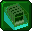 and enter 'tuto' in the filter field. Here, you will discover a variety of commented tutorials that showcase the different features of the console.

* tuto01 : drawing basic shapes
* tuto02 : drawing from a spritesheet
* tuto03 : using a custom bitmap font
* tuto04 : parallax scrolling using layers
* tuto05 : single layer parallax scrolling using rowscroll
* tuto06 : sprite shadow using a shadow layer
* tuto07 : CPU generated image

### <a name="h1.5"></a>1.5. Filesystem

The console features its own internal file system, allowing you to copy files through drag-and-drop directly onto the console window. For instance, you can drag an 'spritesheet.png' image onto the console window and then access it in your code simply as 'spritesheet.png.'

This functionality also facilitates the effortless replacement of resources, be it a sample or an image, while running any game. By dropping a replacement file with the same name onto the window, the console seamlessly utilizes this file instead of the original resource.

You can also access files from outside the console using "file://\<path\>" syntax (only on native version of the console) or "https://\<url\>" to access online resources.

You don't have to edit the code from the console editor, you can use an external editor and simply put the address of the file in the internal code editor :

Type `file://C:/mygame.gd` to load the code from the `C:\mygame.gd` file.

Type `https://mysite.com/mygame.gd` to load the code from the given URL using an HTTP request.

### <a name="h1.6"></a>1.6. Command line / URL arguments

You can use those arguments to control the console's behavior. For instance, to enable fullscreen at launch :

Use `viper.exe --fullscreen` in native mode.

Use `https://html.itch.zone/html/9217920/index.html/?fullscreen=1` in web mode

| Parameter              | Description                                                             |
|------------------------|-------------------------------------------------------------------------|
| **Bios**               |                                                                         |
| `cart=<path>`          | Start a cartridge at launch. `path` = the .gd script to run             |
| `no_deepswitch`        | Disable deepswitch menu (ctrl-shift-\`)                                 |
| `no_docker`            | Disable docker menu                                                     |

| Parameter              | Description                                                             |
|------------------------|-------------------------------------------------------------------------|
| **Graphics**           |                                                                         |
| `no_crt`               | Disable all CRT effects                                                 |
| `no_crt_warp`          | Disable screen warping effect                                           |
| `no_crt_scan`          | Disable scanline effect                                                 |
| `no_crt_mask`          | Disable shadow mask effect                                              |
| `fullscreen`           | Start in fullscreen mode                                                |
| `no_splash`            | Disable splash screen (only on native mode)                             |
| `no_vsync`             | Disable vertical sync (only on native mode)                             |

| Parameter              | Description                                                             |
|------------------------|-------------------------------------------------------------------------|
| **Audio**              |                                                                         |
| `no_audio`             | Start with sound disabled                                               |
| `audio_rate=<rate>`    | Change the audio sample rate (value in Hz)                              |

| Parameter              | Description                                                             |
|------------------------|-------------------------------------------------------------------------|
| **Input**              |                                                                         |
| `neutral_zone=<value>` | Change the controllers default neutral zone (value between 0.0 and 1.0) |

## <a name="h2"></a>2. Viper's BIOS

### <a name="h2.1"></a>2.1. Keyboard shortcuts

| Key              | Command                                                             |
|------------------|---------------------------------------------------------------------|
| Escape<br>Joypad 6*            | Toggle docker menu                                    |
| F12              | Save a screenshot in `%USERPROFILE%\Pictures\Viper`                 |
| Ctrl-Shift-`     | Toggle deepswitch menu                                              |
| X<br>LMB<br>Joypad 0*          | Action1                                               |
| C<br>RMB<br>Joypad 2*          | Action2                                               |
| V<br>Mouse thumb 1<br>Joypad 1*| Action3                                               |
| W<br>Mouse thumb 2<br>Joypad 3*| Action4                                               |

\* : Joypad buttons correspondance

| Button | Sony | XBox | Nintendo |
| ------ | ---- | ---- | -------- |
| 0 | cross | A | B |
| 1 | circle | B | A |
| 2 | square | X | Y |
| 3 | triangle | Y | X |
| 6 | start | menu | + |

## <a name="h3"></a>3. API Overview

### <a name="h3.1"></a>3.1. Language

Viper uses GDScript as scripting language.

See <https://docs.godotengine.org/en/stable/tutorials/scripting/gdscript/index.html> for more information

#### <a name="h3.1.1"></a>3.1.1 Cartridge entry point

The following functions are called by the console :

* `func init()` : called once during the cartridge boot.

This is where external resources should be loaded with `V.gfx.load_img` for images and `V.snd.new_instrument` for sound samples.

* `func update()` : called 60 times per second

This is the designated place to update anything time-dependent. You can't call drawing methods within this function.

* `func draw()` : called every frame

Render one game frame. Framerate might vary from one computer to another. Use `V.gfx.clear()` to erase the previous frame.

#### <a name="h3.1.2"></a>3.1.2 access to the Viper API

All the Viper API can be found under the V singleton :

* `V.gfx` : the graphics API
* `V.snd` : the audio API
* `V.inp` : the V.input API

It also contains a few utilities :

* `V.fps() -> float`
* `V.elapsed() -> float`

Those functions return the number of frames rendered during the last second and the time elapsed in seconds since the game started. Note that you can display an fps counter on screen using the [deepswitch menu](#h2.1).

### <a name="h3.2"></a>3.2. Graphics (V.gfx)

#### <a name="h3.2.1"></a>3.2.1. Layers

The Viper screen size is fixed at 384x224 pixels, and you can retrieve these values using `V.gfx.SCREEN_WIDTH` and `V.gfx.SCREEN_HEIGHT`. The graphics engine supports displaying any number of layers with alpha blending.

All colors are expressed with float components but you can use the [Color8](https://docs.godotengine.org/en/stable/classes/class_%40gdscript.html#class-gdscript-method-color8) constructor to create one from byte values. While coordinates are stored as floats, for pixel-perfect results, it's recommended to truncate them to integers. However, smooth movement can still be achieved using float coordinates.

Each layer is adjustable; you can resize them with `V.gfx.set_layer_size` and reposition them with `V.gfx.set_layer_offset`. Layers can be hidden or shown with `V.gfx.show_layer` and `V.gfx.hide_layer`. By default, only the first layer (layer 1) is displayed.

The console renders layers in increasing ID order, starting with layer 1, followed by layer 2, and so on. You can load spritesheets offscreen with `V.gfx.load_img` and use them as source for blitting operation with `V.gfx.set_spritesheet` and `V.gfx.set_spritesheet_layout`. You can blit sprites with `V.gfx.blit_region` and `V.gfx.blit_sprite`

You can fill a layer with a color with `V.gfx.clear`. The default fill color is transparent.

Each visible layer applies a color operation between its color and the underlying color :

* `V.gfx.LAYEROP_MIX` : new pixel color = layer pixel color blended with background pixel color using the alpha channel value
* `V.gfx.LAYEROP_ADD` : new pixel color = background pixel color + layer pixel color
* `V.gfx.LAYEROP_SUBTRACT` : new pixel color = background pixel color - layer pixel color
* `V.gfx.LAYEROP_MULTIPLY` : new pixel color = background pixel color * layer pixel color

You define the target layer for all drawing functions with `V.gfx.set_active_layer(id)`.

Layers also have advanced features :

You can set per-row and per-column offsets using `V.gfx.set_rowscroll` and `V.gfx.set_colscroll`. These offsets can be utilized to create a per-row/column parallax effect on background layers.

You can configure a layer to render every pixel in a specific color using `V.gfx.set_layer_blit_col`. This feature is useful for drawing a sprite shadow by utilizing the original sprite or coloring the entire sprite in white or red during a hit event.

#### <a name="h3.2.2"></a>3.2.2. Drawing

You can draw various shapes with `V.gfx.line`, `V.gfx.triangle`, `V.gfx.rectangle`, `V.gfx.circle`.

You can blit sprites and images with `V.gfx.blit_region` and `V.gfx.blit_sprite`.

You can use `V.gfx.blit_pixels` to blit a sprite generated from your code. However, it's important to note that this function is significantly slower compared to `V.gfx.blit_region` and `V.gfx.blit_sprite`, which fully leverages GPU processing.

#### <a name="h3.2.3"></a>3.2.3. Font

You define a bitmap font with `set_font` by defining a rectangular zone inside the current spritesheet, and the character size :

`set_font(char_size: Vector2i, rect: Rect2i = Rect2i(0,0,0,0), charset: String="", spacing: Vector2i = Vector2i.ZERO, char_width: PackedByteArray = []) -> int`

Use the `spacing` parameter to add additional space between characters and the `char_width` parameter for proportional fonts. If `charset` is not defined, the full ASCII table from 0 to 255 is expected.

The function returns a number representing this font. You can use this number to print text with `V.gfx.print`.

The console is preloaded with three fonts :

* `V.gfx.FONT_8X8` : the default mono font that contains the complete 128 ascii table characters.
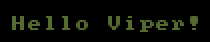
* `V.gfx.FONT_5X7` : a smaller non-mono font that contains the 93 ascii characters from `!` to `~`.
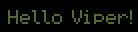
* `V.gfx.FONT_4X6` : a very small mono font that contains the 93 ascii characters from `!` to `~`.
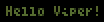

### <a name="h3.3"></a>3.3. Sound (V.snd)

The viper has 6 channels, each capable of playing stereo sound at 44kHz (16kHz on web platform) with float32 samples.

You can completely disable all sounds with `V.snd.disable`.

#### <a name="h3.3.1"></a>3.3.1. Instrument

You can create any number of instruments to produce sound using `V.snd.new_instrument`. Simply pass a Dictionary as a parameter with various keys to define the sound.
Instrument can either utilize additive synthesis (`TYPE = "Oscillator"`) through various oscillators or read samples from .wav files (`TYPE = "Sample"`).

Oscillator instrument keys:

* oscillator parameters

|parameter|wave|
| --- | --- |
|- `OVERTONE` : amount of overtone (TODO)<br>- `OVERTONE_RATIO` : 0 = octave below, 1 = fifth above (TODO)||
|- `SAW` : amount of sawtooth waveform (0.0-1.0)<br>- `ULTRASAW` : amount of ultrasaw in the saw waveform (0.0-1.0) (TODO)|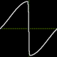|
|- `SQUARE` : amount of square waveform (0.0-1.0)<br>- `PULSE` : width of the square pulse should be in `]0..1[` interval|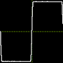|
|- `TRIANGLE` : amount of triangle waveform (0.0-1.0)<br>- `METALIZER` : amount of metalizer in the triangle waveform (0.0-1.0) (TODO)|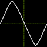|
|- `SIN` : amount of sin waveform (0.0-1.0) (TODO)|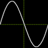|
|- `ABS_SIN` : amount of absolute sin waveform (0.0-1.0) (TODO)|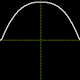|
|- `HALF_SIN` : amount of half-sin waveform (0.0-1.0) (TODO)|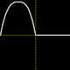|
|- `PSEUDO_SAW` : amount of pseudo-saw waveform (0.0-1.0) (TODO)`|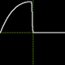|
|- `NOISE` : amount of noise (0.0-1.0)<br>- `NOISE_COLOR` : from white (0.0) to pink (1.0) noise (TODO)||

* filter parameters (TODO)

* `FILTER_BAND` : type of filter (`LOWPASS`, `BANDPASS`, `HIGHPASS`, `NOTCH`)
* `FILTER_DISTO` : amount of distortion (0-200)
* `FILTER_GAIN`: lowshelf filter boost in Db (-40, 40)
* `FILTER_CUTOFF`: upper limit of frequencies getting a boost (0-8000)

* lfo parameters (TODO)

* `LFO_AMOUNT` : amplitude of the lfo waveform (0-1)
* `LFO_RATE` : frequency of the lfo waveform (0-8000)
* `LFO_SHAPE`: type of waveform (`SAW`, `SQUARE`, `TRIANGLE`)
* `LFO_PITCH` : whether the lfo affects the notes pitch (0 or 1)
* `LFO_FILTER`: whether the lfo affects the filter cutoff (0 or 1)
* `LFO_PULSE`: whether the lfo affects the pulse width (0 or 1)
* `LFO_METALIZER`: whether the lfo affects the metalizer amount (0 or 1)
* `LFO_OVERTONE`: whether the lfo affects the overtone amount (0 or 1)
* `LFO_ULTRASAW`: whether the lfo affects the ultrasaw amount (0 or 1)

* envelop parameters

* `ATTACK` : duration of attack phase in seconds
* `DECAY` : duration of decay phase in seconds
* `SUSTAIN` : level of sustain phase between 0.0 and 1.0
* `RELEASE` : duration of release phase in seconds

By default, envelop is altering the note volume. But it can also be used to alter other parameters (TODO) :

* `ENV_AMOUNT` : scale the effect of the envelop on the parameter
* `ENV_PITCH` : amount of envelop altering the note pitch
* `ENV_FILTER` : amount of envelop altering the note pitch
* `ENV_METALIZER` : amount of envelop altering the metalizer parameter of the oscillator
* `ENV_OVERTONE` : amount of envelop altering the overtone parameter of the oscillator
* `ENV_PULSE` : amount of envelop altering the pulse width of the oscillator
* `ENV_ULTRASAW` : amount of envelop altering the utrasaw parameter of the oscillator

Sample instrument keys :

* base parameters
  * `FILE` : path to the .wav file
  * `FREQ` : base frequency of the sound in the file

* looping (TODO)
  * `LOOP_START` : sample index where to start the loop
  * `LOOP_END` : sample index where to end the loop

* envelop
  * `ATTACK` : duration of attack phase
  * `DECAY` : duration of decay phase
  * `SUSTAIN` : duration of sustain phase
  * `RELEASE` : duration of release phase

Examples :

```
var triangle_instrument_id = V.snd.new_instrument({TYPE="Oscillator", OVERTONE=1.0, TRIANGLE=1.0, METALIZER=0.85})
var snare_instrument_id = V.snd.new_instrument({TYPE="Sample",FILE="musics/samples/snare.wav",FREQ=440})
```

Once you defined instruments, you can play sound with `V.snd.play_sound` and `V.snd.play_note`.

`play_note` take a Note object as parameter. You can create such an object with `V.snd.parse_note`. See the [pattern](#h3.3.2) chapter for note format.

#### <a name="h3.3.2"></a>3.3.2. Pattern

A pattern is a list of notes that plays at a specific rate.

* `new_pattern(description)` : register a new pattern and returns its id (0, then incremented for each new pattern).

The description starts with the notes duration (or speed at which the pattern plays the notes). The duration is divided by 120. For example :

* 01 => each note duration is 1/120 second
* 02 => each note duration is 1/60 second
* 04 => each note duration is 1/30 second

Then it's followed by a list of notes.
Example :

```
V.snd.new_pattern("02 F.207. G.207. D.307. C.407.")
```

The note format is [note] [octave] [instrument_id] [volume] [fx] with :

* note : C. C# D. D# E. F. F# G. G# A. A# B.
* octave : between 0 and 8
* volume : hexadecimal between 1 (lowest) and F (highest)

  you can define the balance by using two volume values :
  * F.2070 => volume is 7 for both left and right channels
  * F.20290 => volume is 2 for left channel and 9 for right channel

* fx : special sound effect between 0 and 5 :
  * 0 or '.' : no effect
  * 1 : slide
  * 2 : vibrato
  * 3 : drop
  * 4 : fade in
  * 5 : fade out

Note that for more control over fade-in/fade-out effects, you can use an envelope on the instrument instead of effects. However, note that the envelope will affect all notes played with the instrument.

You can add a silence by filling the note format with 6 dots : `......`
Example :

```
new_pattern("16 C#3915 ...... ...... C#3915 D#3835")
```

Once a pattern is defined, you can play it with `V.snd.play_pattern`.

#### <a name="h3.3.3"></a>3.3.3. Music

A music is a list of *sequences*, each sequence being a list of patterns being played simultaneously on different channels.

You define a song using `V.snd.new_music`, using a Dictionary as parameter with following keys :

* `SEQ` is an array of 6 characters string, each describing which pattern to play on specific channels. Use a dot for unused channels.

Example :

```
V.snd.new_music({SEQ=["07....","08...."]})
```

This music is composed of two sequences. The first one plays pattern 0 on channel 0 and pattern 7 on channel 1. The second plays pattern 0 on channel 0 and pattern 8 on channel 1.

Each channel pattern is encoded as an hexadecimal number between 0 and F.

If the music requires more than 16 patterns, you extends this limit to 256 (from `00` to `FF`) using a double digit format with 12 characters strings :

```
V.snd.new_music({SEQ=["0007........","0008........"]})
```

If the song requires less than 16 patterns but those pattern ids are bigger than 16, you can use a `PATLIST` key to define the list of patterns used by the music :

```
V.snd.new_music({PATLIST=[20,21,22],SEQ=["01....","02...."]})
```

* Sequence 1 : pattern 20 on channel 0 and pattern 21 on channel 1
* Sequence 2 : pattern 20 on channel 0 and pattern 22 on channel 1

* PATLIST is an array of pattern ids used in the song.

You can play a music with `V.snd.play_music`. The channel_mask defines the channels to be used to play the music patterns. There must be enough channel to play all the simultaneous patterns in every sequence of the music.

For example with the previous song, which requires 3 channels, you can use the binary mask 000011 = 3. This would result in the channels 0 and 1 being reserved for the song.

#### <a name="h3.3.4"></a>3.3.4. Midi

TODO

### <a name="h3.4"></a>3.4. Input (V.inp)

#### <a name="h3.4.1"></a>3.4.1. Keyboard (TODO)

* `key(key)` : return true if key is pressed. key is a value from Godot's [Key enum](https://docs.godotengine.org/en/stable/classes/class_%40globalscope.html#enum-globalscope-key)
* `key_pressed(key)` : return true if key was pressed during last frame
* `key_released(key)` : return true if key was released during last frame

The value for the `key` scan codes are :

* `V.inp.KEY_0`..`V.inp.KEY_9` : upper digits
* `V.inp.KEY_A`..`V.inp.KEY_Z` : letters (this returns KEY_Q when you press A on an AZERTY keyboard)
* `V.inp.KEY_F1`..`V.inp.KEY_F10` : function keys

Arrow keys : (also triggered by numeric keypad if numlock is disabled)

* `V.inp.KEY_UP`
* `V.inp.KEY_DOWN`
* `V.inp.KEY_LEFT`
* `V.inp.KEY_RIGHT`

Special keys :

* `V.inp.KEY_TAB`
* `V.inp.KEY_SPACE`
* `V.inp.KEY_BACKSPACE`
* `V.inp.KEY_ENTER`
* `V.inp.KEY_ESCAPE`
* `V.inp.KEY_PRINTSCREEN`
* `V.inp.KEY_SCROLLLOCK`
* `V.inp.KEY_PAUSE`
* `V.inp.KEY_INSERT`
* `V.inp.KEY_HOME`
* `V.inp.KEY_DELETE`
* `V.inp.KEY_END`
* `V.inp.KEY_PAGEDOWN`
* `V.inp.KEY_PAGEUP`
* `V.inp.KEY_CTRL`
* `V.inp.KEY_LSHIFT`
* `V.inp.KEY_RALT`
* `V.inp.KEY_RSHIFT`

#### <a name="h3.4.2"></a>3.4.2. Mouse (TODO)

List of button values :

* 0: Main button pressed, usually the left button or the un-initialized state
* 1: Auxiliary button pressed, usually the wheel button or the middle button (if present)
* 2: Secondary button pressed, usually the right button
* 3: Fourth button, typically the Browser Back button
* 4: Fifth button, typically the Browser Forward button

Functions :

* `mouse_button(num)` : return true if mouse button num is pressed.

 You can use any button number or the predefined constants :

* `V.inp.MOUSE_LEFT`
* `V.inp.MOUSE_MIDDLE`
* `V.inp.MOUSE_RIGHT`

* `mouse_button(num)` : return true if mouse button num was pressed since the last game tick
* `mouse_button_released(num)` : return true if mouse button num was released since the last game tick
* `mouse_pos()`: return the mouse position in pixels

Example :

```
local mousex,mousey = V.inp.mouse_pos()
```

Note : you can show/hide the mouse cursor with the V.gfx API :

* `show_mouse_cursor(onoff)`

Example :

```
V.gfx.show_mouse_cursor(false)
```

#### <a name="h3.4.3"></a>3.4.3. Gamepad (TODO)

In the following functions, `player_num` value is :

* `0` : the keyboard (arrows for directions and X,C,V,Z,Escape,Enter corresponding to A,X,B,Y,Select,Start on the controller)
* `1` to `8` : up to 8 controllers support

This makes it possible to use the same API whether the player is using the keyboard or the controller.

Functions :

* `pad_button(player_num, num)` : return true if button num for player player_num is pressed
* `pad_button_pressed(player_num, num)` : return true if button num for player player_num was pressed since the last game tick

 You can use these constants for the num value :

* `V.inp.XBOX360_A`
* `V.inp.XBOX360_B`
* `V.inp.XBOX360_X`
* `V.inp.XBOX360_Y`
* `V.inp.XBOX360_LB`
* `V.inp.XBOX360_RB`
* `V.inp.XBOX360_SELECT`
* `V.inp.XBOX360_START`
* `V.inp.XBOX360_LS`
* `V.inp.XBOX360_RS`
* `pad_ls(player_num)` : return the left analog stick axis values (between -1 and 1) for player player_num

 Example :
 `local x,y = V.inp.pad_ls(1)`

* `set_ls_neutral_zone(value)` : sets the left analog stick neutral zone (between 0 and 1)
* `pad_rs(player_num)` : return the right analog stick axis values (between -1 and 1) for player player_num
* `set_rs_neutral_zone(value)` : sets the right analog stick neutral zone (between 0 and 1)
* `pad_lt(player_num)` : return the left trigger value (between -1 and 1) for player player_num
* `pad_rt(player_num)` : return the right trigger value (between -1 and 1) for player player_num

#### <a name="h3.4.4"></a>3.4.4. Generic V.input

If you want to support both keyboard and controller at the same time in a single player game, you can use these generic functions instead :

* `V.inp.action1()` returns true if the controller A button or keyboard X key are pressed
* `V.inp.action2()` returns true if the controller X button or keyboard C key are pressed
* `V.inp.action3()` returns true if the controller B button or keyboard V key are pressed
* `V.inp.action4()` returns true if the controller Y button or keyboard Z key are pressed
* `V.inp.menu()` returns true if the controller menu button or keyboard ESC key are pressed

The same functions with the _pressed suffix exist to check if the button was pressed since the last game tick. They all return a boolean.

* `V.inp.action1_pressed()`
* `V.inp.action2_pressed()`
* `V.inp.action3_pressed()`
* `V.inp.action4_pressed()`
* `V.inp.menu_pressed()`

Those last function will check controller #1 and keyboard if the player is not defined, else only the controller #player (0=keyboard, 1-8=controller)

* `V.inp.up([player])` value between 0 and 1
* `V.inp.down([player])` value between 0 and 1
* `V.inp.left([player])` value between 0 and 1
* `V.inp.right([player])` value between 0 and 1
* `V.inp.up_pressed([player])`
* `V.inp.down_pressed([player])`
* `V.inp.left_pressed([player])`
* `V.inp.right_pressed([player])`

## <a name="h4"></a>4. Cheatsheet

|**<a name="h4.1"></a>4.1 common operations**|`V`|
| --- | --- |
|`fps()`|Return the frames per second of the game|
|`elapsed()`|Return the time elpased in seconds since the game started|
|**<a name="h4.2"></a>4.2 Graphics - layer operations**|`V.gfx`|
|`set_layer_operation(layer_id: int,op: int)`|set layer's blending op :<br>`LAYEROP_(SET|ADD|MULTIPLY|SUBTRACT)`|
|`set_layer_size_v(layer_id: int, size: Vector2)`|set layer's size in pixels|
|`set_layer_size(layer_id: int, w: float, h: float)`|set layer's size in pixels|
|`set_layer_offset_v(layer_id: int, offset : Vector2)`|set layer's offset in pixels. Use layer_id -1 for all visible layers|
|`set_layer_offset(layer_id: int, x:float, y:float)`|set layer's offset in pixels. Use layer_id -1 for all visible layers|
|`set_active_layer(layer_id: int)`|set target layer for drawing functions|
|`show_layer(layer_id: int)`|set a layer visible|
|`hide_layer(layer_id: int)`|set a layer invisible|
|`is_layer_visible(layer_id: int) -> bool`|check if layer is visible|
|`set_layer_blit_col(layer_id: int, col: Color)`|force non transparent pixels color|
|`unset_layer_blit_col(layer_id: int)`|disable forced color|
|`set_rowscroll(first_row: int, last_row:int, start_offset: float, end_offset: float = start_offset)`|set per-row offset for current layer|
|`set_colscroll(first_col: int, last_col:int, start_offset: float, end_offset: float = start_offset)`|set per-column offset for current layer|
|**<a name="h4.3"></a>4.3 Graphics - drawing operations**|`V.gfx`|
|`clear(col:Color = Color.TRANSPARENT)`|fill a layer with a color|
|`line(p1: Vector2, p2: Vector2, col: Color)`|draw a line|
|`rectangle(rect: Rect2,col:Color,fill=true)`|draw or fill a rectangle|
|`triangle(p1: Vector2, p2: Vector2, p3: Vector2, col:Color, fill=true)`|draw or fill a triangle|
|`circle(center: Vector2,radius_x: float,radius_y=0.0,col:Color=Color.WHITE)`|fill a circle|
|`blit_region(dest_pos: Vector2 = Vector2.ZERO, source_pos: Vector2 = Vector2.ZERO, source_size : Vector2 = Vector2.ZERO, col: Color=Color.WHITE, dest_size: Vector2 = Vector2.ZERO, hflip : bool = false, vflip : bool = false)`|blit a region of current |`blit_region_rot(dest_pos: Vector2 = Vector2.ZERO, source_pos: Vector2 = Vector2.ZERO, source_size : Vector2 = Vector2.ZERO, col: Color=Color.WHITE, angle : float = 0.0, dest_size: Vector2 = Vector2.ZERO, hflip : bool = false, vflip : bool = false)`|blit a region of current spritesheet on current layer|
|`blit_sprite(sprite_num: int, dest_pos: Vector2, col: Color = Color.WHITE, dest_size: Vector2 = Vector2.ZERO, hflip: bool = false, vflip: bool = false)`|blit a sprite on current layer. See `set_spritesheet_layout`|
|`blit_sprite_rot(sprite_num: int, dest_pos: Vector2, col: Color = Color.WHITE, angle: float = 0.0, dest_size: Vector2 = Vector2.ZERO, hflip: bool = false, vflip: bool = false)`|blit a sprite on current layer. See `set_spritesheet_layout`|
|`blit_pixels(pos: Vector2, sprite_width: int, pixel_data:PackedByteArray, size: Vector2=Vector2.ZERO)`|blit a sprite defined by an array of 8bit RGB values. Use `size` to scale it|
|`print(font_id : int, text: String, pos:Vector2, col: Color = Color.WHITE)`|draw some text|
|**<a name="h4.4"></a>4.4 Graphics - image operations**|`V.gfx`|
|`await load_img(filepath: String) -> int`|load an image, return its id|
|`set_spritesheet(img_id: int)`|use a loaded image as source for blit operations|
|`get_image_size(img_id: int) -> Vector2`|get the size of a loaded image|
|`set_spritesheet_layout(sprite_size: Vector2i, offset: Vector2i = Vector2i.ZERO, grid_width: int = 0)`|define sprites layout for current spritesheet|
|**<a name="h4.5"></a>4.5 Graphics - font operations**|`V.gfx`|
|`set_font(char_size: Vector2i, rect: Rect2i = Rect2i(0,0,0,0), charset: String="", spacing: Vector2i = Vector2i.ZERO, char_width: PackedByteArray = []) -> int`|define a custom font, monospace or proportional if using the `char_width` array|
|**<a name="h4.6"></a>4.6 Audio - general operations**|`V.snd`|
|`enable()`|activate audio system|
|`disable()`|deactivate audio system (mute everything)|
|`play_sound(inst_id: int, freq:float, duration:float, lvolume:float = 1.0, rvolume:float=-1.0, channel: int =-1)`|play a sound|
|`parse_note(note: String) -> Note`|Convert a note in string format to an object usable with `play_note`|
|`play_note(note:Note, duration:float, channel: int=-1)`|play a note|
|**<a name="h4.7"></a>4.7 Audio - channel operations**|`V.snd`|
|`get_available_channel(mask:int = 0) -> int`|get a free channel or -1|
|`set_channel_volume(channel: int, lvolume: float, rvolume: float=-1)`|dynamically change a channel volume|
|`set_channel_balance(channel: int, balance: float)`|dynamically change a channel balance between -1(left) and 1(right)|
|`set_channel_freq(channel_id: int, freq: float)`|dynamically change the frequency of the current sound/note played on a channel|
|`is_channel_silent(channel_id: int) -> bool`|wether a channel produces sound|
|`get_channel_current_note(channel_id: int) -> Note`|current note played on a channel or `null`|
|`mute_channel(channel:int)`|mute a channel|
|`unmute_channel(channel:int)`|unmute a channel|
|`solo_channel(channel:int)`|mute all channels but one|
|**<a name="h4.8"></a>4.8 Audio - music operations**|`V.snd`|
|`new_instrument(desc:Dictionary) -> int`|register a new instrument|
|`new_pattern(desc:String) -> int`|register a new pattern|
|`play_pattern(pattern_id: int, channel_id: int=-1,loop=false)`|play a pattern. `channel_id` -1 to use first available channel|
|`new_music(desc:Dictionary) -> int`|register a new music|
|`stop_music()`|stop all channels playing music|
|`play_music(music_id:int,channel_mask:int,loop:bool=true)`|play a music on specified channels|
|**<a name="h4.9"></a>4.9 Input - generic operations**|`V.inp`|
|`action1() -> bool`|wether action1 is currently pressed|
|`action2() -> bool`|wether action2 is currently pressed|
|`action3() -> bool`|wether action3 is currently pressed|
|`action4() -> bool`|wether action4 is currently pressed|
|`menu() -> bool`|wether menu is currently pressed|
|`action1_pressed() -> bool`|wether action1 was pressed since last update|
|`action2_pressed() -> bool`|wether action2 was pressed since last update|
|`action3_pressed() -> bool`|wether action3 was pressed since last update|
|`action4_pressed() -> bool`|wether action4 was pressed since last update|
|`menu_pressed() -> bool`|wether menu was pressed since last update|
|`right(player=null) -> float`|amount of right movement between 0.0 and 1.0|
|`left(player=null) -> float`|amount of left movement between 0.0 and 1.0|
|`up(player=null) -> float`|amount of up movement between 0.0 and 1.0|
|`down(player=null) -> float`|amount of down movement between 0.0 and 1.0|
|`right_pressed(player=null) -> bool`|wether right was pressed since last update|
|`left_pressed(player=null) -> bool`|wether left was pressed since last update|
|`up_pressed(player=null) -> bool`|wether up was pressed since last update|
|`down_pressed(player=null) -> bool`|wether down was pressed since last update|
|**<a name="h4.10"></a>4.10 Input - keyboard operations**|`V.inp`|
|`key(keycode : Key) -> bool`|wether a physical key is pressed on the keyboard|
|**<a name="h4.11"></a>4.11 Input - mouse operations**|`V.inp`|
|`mouse_button(button: int) -> bool`|wether a mouse button is currently pressed|

## <a name="h5"></a>5. FAQ

**How can I generate 1D/2D/3D noise ?**

> See <https://docs.godotengine.org/en/stable/classes/class_noise.html>

**Are there tweening utilities ?**

You can use the `Tween` class. Example :

`var value = Tween.interpolate_value(start_value, delta_value, t, duration, Tween.TRANS_CUBIC, Tween.EASE_IN_OUT)`

> See <https://docs.godotengine.org/en/stable/classes/class_tween.html>

**How can I save data locally ?**

> See <https://docs.godotengine.org/en/stable/tutorials/io/saving_games.html>
